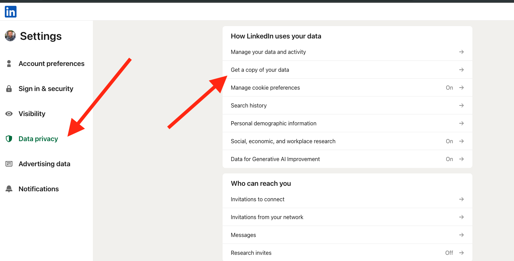

# AI Contacts Search Assistant

Welcome to the **AI Contacts Search Assistant** project! This application allows users to intelligently search through their LinkedIn professional contacts to find the most relevant connections based on specific queries. Leveraging AI and semantic search capabilities, the assistant can help answer complex questions about your professional network.

This project was created by Alex Furmansky of Magnetic Ventures LLC.

Connect on LinkedIn: [https://www.linkedin.com/in/alexfurmansky/](https://www.linkedin.com/in/alexfurmansky/)

Read on Substack: [https://magneticgrowth.substack.com//](https://magneticgrowth.substack.com//)


## Table of Contents

- [Features](#features)
- [Prerequisites](#prerequisites)
- [Installation](#installation)
- [Usage](#usage)
  - [Data Ingestion](#data-ingestion)
  - [Running the AI Agent](#running-the-ai-agent)
- [Project Structure](#project-structure)
- [Configuration](#configuration)
- [Database Schema](#database-schema)
- [Security Considerations](#security-considerations)
- [Contributing](#contributing)
- [License](#license)

## Features

- **Data Ingestion**: Import your LinkedIn connections from a CSV file and rebuild their professional profiles using the Proxycurl API.
- **Local Database Storage**: Store contacts, educational background, and professional experiences in a local SQLite database.
- **Semantic Search**: Use vector embeddings to perform contextual similarity searches across your contacts.
- **AI-Powered Query Handling**: Ask complex questions about your contacts, and the AI agent will strategize and perform searches to find the most relevant results.
- **Interactive Interface**: Converse with the AI agent to refine your queries and get detailed responses.

## Prerequisites

- **Python 3.7+**
- **API Keys**:
  - [OpenAI API Key](https://platform.openai.com/account/api-keys)
  - [Proxycurl API Key](https://nubela.co/proxycurl)
  - Note that these are both paid APIs.

## Installation

1. **Clone the Repository**:

   ```bash
   git clone https://github.com/MagneticStudio/LinkedIn-AI-Search-Agent
   cd LinkedIn-AI-Search-Agent
   ```

2. **Create a Virtual Environment** (optional but recommended):

   ```bash
   python -m venv venv
   source venv/bin/activate  # On Windows, use `venv\Scripts\activate`
   ```

3. **Install Dependencies**:

   ```bash
   pip install -r requirements.txt
   ```

## Usage

### Data Ingestion

The data ingestion process involves reading your LinkedIn connections from a CSV file and populating the local database with detailed profile information.

1. **Export Your LinkedIn Connections**:

   - Go to [LinkedIn Data Export](https://www.linkedin.com/psettings/member-data) and request an archive of your connections.
   - Download the `Connections.csv` file from the archive.
   - Here's how:
    
    
    


2. **Run the Data Ingestion Script**:

   ```bash
   python app.py
   ```

   - This will start a Flask web app where you can upload your `Connections.csv` file.
   - You do not need to remove the headers from the csv or reformat it in any way
   - The application will process each LinkedIn URL, fetch detailed profiles using the Proxycurl API, and store them in the local database.
   - You can watch the progress in the terminal. You can let it run in background. When complete, you'll see a table of contacts in the browser.
   - The app only needs to be run once per import. You can use the AI Agent as many times as you want thereafter.  You'll also see a contacts.db and several .index embeddings files in your directory.
   - You can provide it with updated .csv files and it will only append new entries not previously processed.

### Running the AI Agent

Interact with the AI agent to search through your contacts using natural language queries.

1. **Run the AI Agent Script**:
    - Open a new terminal window.
   ```bash
   python ai_agent.py
   ```

2. **Interact with the Assistant**:

   - Type your query when prompted. Examples:

     ```
     I'm organizing a dinner in Miami for founders in AI. Who should I invite?
     Who could be a good speaker for a panel on health tech in Los Angeles?
     ```

   - The assistant will process your query, strategize the search, and provide you with relevant contacts.

## Project Structure

```plaintext
.
├── ai_agent.py          # Main AI agent script
├── ai_actions.py        # Functions used by the AI agent
├── app.py               # Flask application for data ingestion
├── db_handler.py        # Database operations
├── vector_handler.py    # Handle vector embeddings and searches
├── requirements.txt     # Python dependencies
├── README.md            # Project documentation
├── .env.example         # Example environment variables file
└── ...
```

## Configuration

The application uses environment variables for configuration. Copy the example `.env` file and update it with your API keys and desired settings.

1. **Create a `.env` File**:

   ```bash
   cp sample.env .env
   ```

2. **Set Your API Keys**:

   There is a sample.env file you can use for reference. Either way, just make sure you have a .env file.
   
   Open `.env` and set your OpenAI and Proxycurl API keys:

   ```env
   OPENAI_API_KEY=your_openai_api_key
   PROXYCURL_API_KEY=your_proxycurl_api_key
   
   ```
   You can also set your key for langchain / langsmith to audit how the agent performs.

4. **Other Configurations**:

   Adjust other settings as needed, such as database name, embedding dimensions, and file paths.

## Database Schema

The SQLite database consists of the following tables:

- **contacts**: Stores basic contact information (ID, full name, headline, summary, location, etc.).
- **experiences**: Professional experiences related to each contact.
- **education**: Educational background for each contact.
- **contacts_fts**, **experiences_fts**, **education_fts**: Full-Text Search (FTS) tables to enable fuzzy searching.

## Security Considerations

- **API Keys**: Ensure your API keys are kept secure and are not checked into version control. Use the `.env` file to store sensitive information.
- **Input Validation**: The application includes input sanitization to prevent SQL injection and other security vulnerabilities.
- **Dependencies**: Regularly update dependencies to incorporate security patches.

## Contributing

Contributions are welcome! Please follow these steps:

1. **Fork the Repository**:

   Click the "Fork" button at the top right of the repository page.

2. **Create a New Branch**:

   ```bash
   git checkout -b feature/your-feature-name
   ```

3. **Commit Your Changes**:

   ```bash
   git commit -am 'Add a new feature'
   ```

4. **Push to the Branch**:

   ```bash
   git push origin feature/your-feature-name
   ```

5. **Submit a Pull Request**:

   Go to your forked repository and click the "New Pull Request" button.

## License

   This project is licensed under the GNU Affero General Public License v3.0. See the [LICENSE](LICENSE) file for details.

---

Feel free to open an issue or submit a pull request for any improvements or bug fixes. We hope this project helps you make the most of your professional network!
